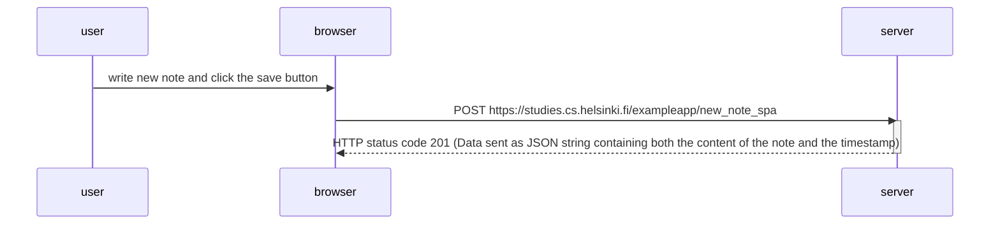

```mermaid
    sequenceDiagram
    participant user
    participant browser
    participant server

    user->>browser: write new note and click the save button

    browser->>server: POST https://studies.cs.helsinki.fi/exampleapp/new_note_spa
    activate server
    server-->>browser: HTTP status code 201 (Data sent as JSON string containing both the content of the note and the timestamp)
    deactivate server

```